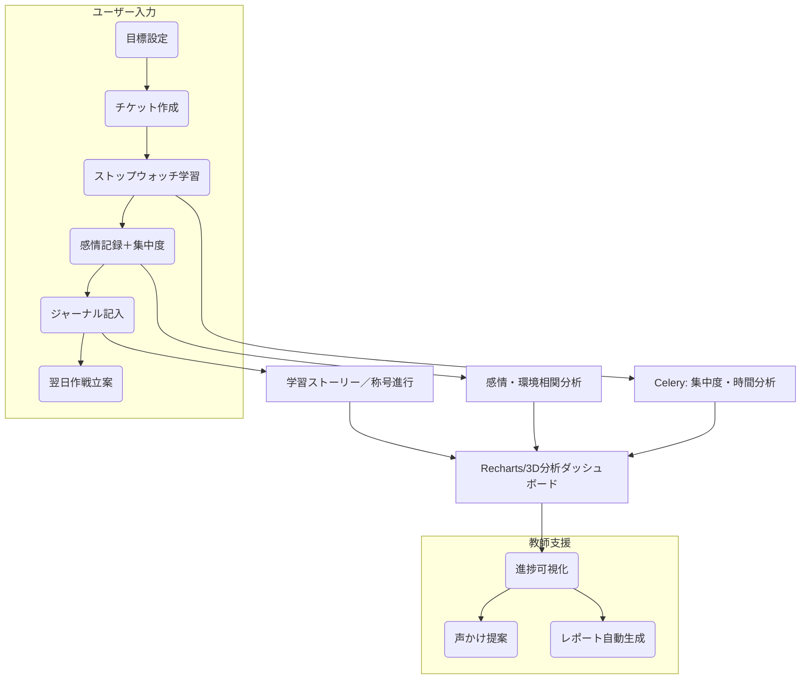

# 🧠 RDD（要求駆動開発）ドキュメント：学習支援アプリ「知的な伴走者」

## 🎯 1. 要求定義（Requirements）

### 1.1 ユーザー要求

| ユーザー       | 要求内容                                       |
| ---------- | ------------------------------------------ |
| 学習者        | 継続できる目標設定とタスク管理、気分や感情を反映した学習計画、自分の成長を実感したい |
| 教師         | 生徒の進捗を把握し、適切なフィードバックを行いたい。指導の負担を減らしたい      |
| 保護者（オプション） | 学習状況のレポートを簡単に確認したい                         |

### 1.2 システム要求

| 要求               | 内容                                      |
| ---------------- | --------------------------------------- |
| チケット駆動管理         | 学習タスクをチケットとして作成、管理し、目標に紐づけることができる       |
| 感情記録             | 学習前後の感情（絵文字タグ等）を記録し、集中度や環境と関連づけて分析する    |
| 振り返り機能           | 日報や週報形式でのジャーナルを記入し、自己認知を深める機能           |
| 教師支援             | 声かけテンプレ、自動レポート生成、放置チケット通知など指導負担を軽減する仕組み |
| データ可視化           | 学習時間、集中度、感情ログなどをグラフで可視化する機能             |
| ストーリー・ゲーミフィケーション | 作戦名や称号、章構造などで学習に物語性を与える                 |
| 非同期処理            | Celeryなどを用いた非同期分析／通知実装                  |
| モバイル・PWA対応       | オフライン学習記録、Push通知によるリマインダーなど             |

---

## 🧩 2. 機能一覧（Features）

### 🎯 目標・戦略設計

- 長期・中期・短期目標の階層管理
- 学習スタイル・好み・苦手要素から戦略提案（ルールベース＋将来的ML）
- 作戦名ジェネレーター：気分・教科・曜日を入力にユニークな命名

### 📋 チケット管理

- チケット作成／ステータス／進捗バー／テンプレート
- 放置チケット検出／分割提案／チケット分析
- 教師→生徒へのチケット割当・提案履歴

### 🧠 感情・集中ログ

- 学習前後の気分・集中度・環境（BGM/場所）記録
- 週間ヒートマップ／集中ゾーン分析／集中トリガー可視化

### 📝 ジャーナル・ふりかえり

- ガイド付き日報／週報テンプレート
- 「今日の気づき」「今週の一番の学び」など自由記述＋選択項目

### 📊 可視化と分析

- 学習時間、集中度、感情をRechartsで表示
- 作戦名や学習環境との相関グラフ（散布図／ヒートマップ）
- 成果ハイライト生成

### 🎭 ゲーミフィケーション

- 学習章構造とストーリープログレッション
- 称号・ストリーク・連続達成ボーナス

### 🤝 教師支援

- 声かけテンプレ／CSV・PNG出力／ダッシュボード
- 自動レポート生成（週報ベース）
- WebSocket通知（チケット更新・放置検出）

---

## 🏗️ 3. 図解（アーキテクチャ＋フロー）



---

## 🛠️ 4. 使用ライブラリ・パッケージ一覧（バージョン付き）

### バックエンド（Python / Django）

- `Django==5.1.4`
- `django-ninja==1.4.3`
- `django-ninja-extra==0.30.1`
- `django-ninja-jwt==5.3.0`
- `psycopg[binary]==3.2.3`
- `django-redis==5.4.0`
- `celery[redis]==5.4.0`
- `django-celery-beat==2.7.0`
- `redis==5.2.0`
- `python-decouple==3.8`
- `sentry-sdk[django]==2.19.0`
- `django-anymail==12.0`

### 分析・補助

- `orjson==3.10.12`
- `python-dateutil==2.9.0`
- `pandas>=2.2.3`
- `numpy>=1.24.0,<2.0.0`
- `faker==33.1.0`

### 型安全・テスト

- `mypy==1.13.0`
- `django-stubs==5.1.0`
- `pytest-django==4.9.0`
- `factory-boy==3.3.1`

### フロントエンド

- `Next.js 14`
- `React 18`
- `TypeScript 5.6.3`
- `TailwindCSS 3.4.14`
- `Recharts 2.12.7`
- `Framer Motion 11.11.17`
- `Radix UI (最新)`
- `Lucide React 0.451.0`
- `SWR 2.2.5`
- `NextAuth.js 4.24.10`

---

## 🏗️ 5. バックエンド アプリケーション構成

### 5.1 推奨Django アプリケーション構成

```
learning_companion/
├── config/              # プロジェクト設定
├── accounts/            # ユーザー認証・プロフィール
├── goals/               # 目標管理（階層化）
├── tickets/             # チケット・タスク管理
├── emotions/            # 感情記録・集中度ログ
├── journal/             # 振り返りジャーナル
├── analytics/           # データ分析・可視化
├── teacher_support/     # 教師支援機能
├── notifications/       # 通知・アラート
├── gamification/        # ゲーミフィケーション
└── core/                # 共通ユーティリティ
```

### 5.2 各アプリケーションの責務

| アプリ | 主な責務 | 主要モデル例 |
|--------|----------|-------------|
| `accounts` | ユーザー認証、プロフィール、学習スタイル設定 | User, UserProfile, LearningStyle |
| `goals` | 長期・中期・短期目標の階層管理、戦略提案 | Goal, Strategy, GoalProgress |
| `tickets` | チケット作成・管理、進捗追跡、分割提案 | Ticket, TicketStatus, TicketTemplate |
| `emotions` | 感情記録、集中度、学習環境データ | EmotionLog, ConcentrationLevel, StudyEnvironment |
| `journal` | 日報・週報、振り返りテンプレート | DailyJournal, WeeklyReflection, JournalTemplate |
| `analytics` | データ分析、相関分析、成果ハイライト | StudyAnalytics, CorrelationData, Achievement |
| `teacher_support` | 声かけテンプレ、レポート生成、ダッシュボード | TeacherTemplate, StudentReport, Dashboard |
| `notifications` | Celeryタスク、WebSocket通知、リマインダー | Notification, Reminder, AlertRule |
| `gamification` | 称号、ストーリー進行、作戦名ジェネレーター | Badge, Story, Chapter, OperationName |
| `core` | 共通ユーティリティ、基底クラス | BaseModel, CommonMixin, Utils |

### 5.3 アプリケーション作成コマンド

```bash
# 基本プロジェクト作成
django-admin startproject config .

# 各アプリケーション作成
python manage.py startapp accounts
python manage.py startapp goals
python manage.py startapp tickets
python manage.py startapp emotions
python manage.py startapp journal
python manage.py startapp analytics
python manage.py startapp teacher_support
python manage.py startapp notifications
python manage.py startapp gamification
python manage.py startapp core
```

---

このRDDは、ver.1.1〜2.0および追加提案をすべて統合した要求ドキュメントです。 実装・画面設計・API設計をこのベースに進められます。

